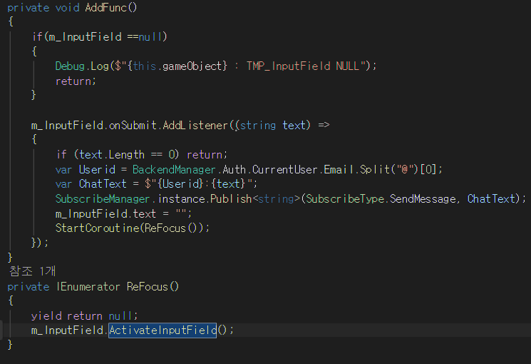
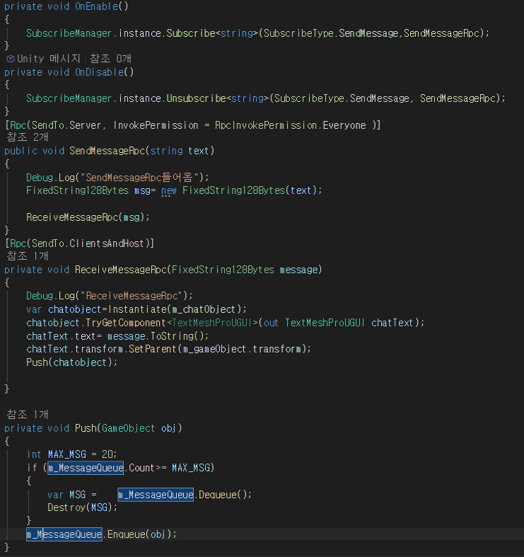

### 채팅관련 스크립트 ``ChatSend``,``ChatSendServer``

- ChatSend
  - 채팅을 치고 Enter를 쳤을 때 실행되는 함수 등록
  
   함수명 어떤걸로 만들지 고민하다가 잘 몰라서 일단 AddFunc 이라고 만듬
   Enter를 쳤을 때  인풋필드에 기록했던 내용과 나의 이메일 앞부분을 합쳐  출력시키는 객체에 전송한다  
   그리고 입력했던 것을 비우고 다시 포커스를 잡는다
   Enter를 치면 인풋필드에 포커스를 잃어 다시 마우스로 클릭해야하기 때문에 ReFocus를 제작
   코루틴으로 만든 이유는 이게 Enter치고나서 바로 포커스를 잡으면 간헐적으로 안되서 한프레임 뒤에 실행되게 만듬

---

- ChatSendServer

해당 클래스는 ChatSend에서 Enter를 쳤을 때 채팅내용과 이메일 앞부분들이 저 클래스쪽으로 넘어가는데  

`` SendMessageRpc``호출하여 채팅내용을 뿌려달라고 요청한다.  
``ReceiveMessageRpc`` 모든 클라이언트 와 호스트 들에게 뿌려진다

그리고 채팅 오브젝트가 많아지면 삭제하게도 만듦
다만 이부분은 추후 개선 이 필요한 GC발생이 빈번할 수도 있음