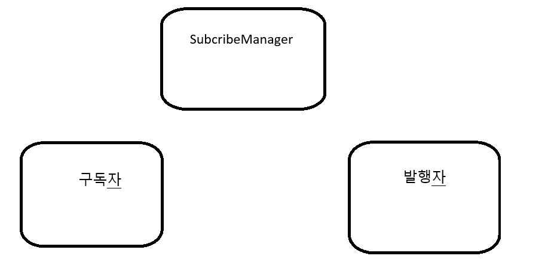

다른 클래스에 데이터들을 접근할 때 또는 메서드들에 접근할 때  
싱글톤 처리를 할 때가 있다.  

싱글턴 처리한 데이터 예를 들어서 플레이어가 있다고 하자
```csharp
public class Player
{
    public static instance {get; private set;}
    public string Playername;
    public int Level;
    public int Money;
    ....

}

이런식으로 싱글톤 처리하고 접근 할 때

Player.instance.Level 이런식으로 접근하게 된다면 
강한 결합 때문에 만약 수정을하게 된다면 player 객체를 사용하는 
다른 클래스들은 문제가 발생 할 수도 있다.

이러한 문제를 해결하기 위해 옵저버 패턴을 사용한 
subscribeManager를 만들어 봤다.
```

----
 
 
매니저 클래스가 함수를 구독하고  
다른 곳에서 호출이 필요할 때 매니저 클래스에서 접근해     
구독한 타입을 넣고 호출 해주면된다.  