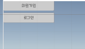
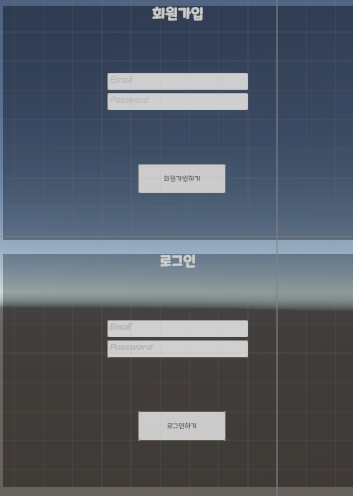
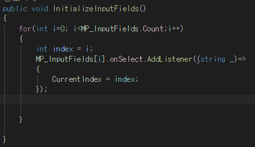
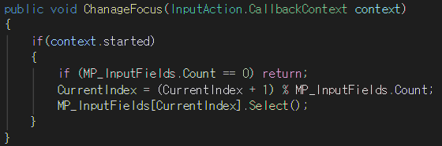

# 회원가입 및 로그인 

 

- 회원가입 UI 버튼을 제작
- 행동 과 로직을 분리함.

### 회원가입_ButtonClick
- ButtonClick 이라는 스크립트를 사용
- 실제 로직은 분리
    - UI 버튼 또는 이미지 같은 것들을 클릭 또는 hover하는 경우가 많은데  
    이런 클릭을 했다 Hover를 했다 등, 추상적인   행동을 로직으로 만들고 실제 기능들은 따로 만들어서 주입하는 방식을 사용했다.
     

### 개선하면 좋을법한 것들
- 1. 지금 Button Click 이라고 만들었는데  UI Click이라고 이름을 바꿔서
다른 UI에서도 사용할수 있게 만들면 좋을거 같다.

----

- 백그라운드 이미지 하나에 알파값 줄임
- TMP인풋필드 2개 사용
- TMP 버튼 사용 

### 만든 기능
- Enter 입력 처리
    

- Tab 입력 처리
    - 인풋시스템 사용해서 Tab기능 처리
    - 인풋필드가 선택 됐으면 해당 인풋필드로 인덱스 변경
    
    - Tab 버튼을 누르면 인풋필드 포커스 이동 처리했다.
     

``InitializeInputFields``  
 Tab기능을 사용하지 않고 클릭으로 인풋필드 포커스를 변경했을 때   
CurrentIndex 전에 있던 인풋필드 인덱스에 머물러 있기 때문에  
클릭해서 포커스가 잡혔을 때 해당 인풋필드 인덱스로 변경처리하는 로직  

``ChanageFocus``  
Tab키를 눌렀을 때 현재 포커스가 잡힌 인풋필드에서  
 다음 인풋필드에 포커스를 잡는다.  

